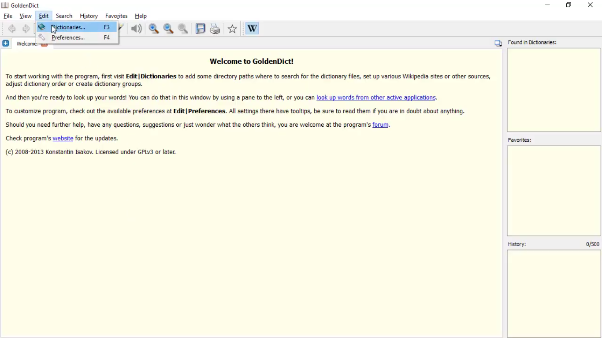
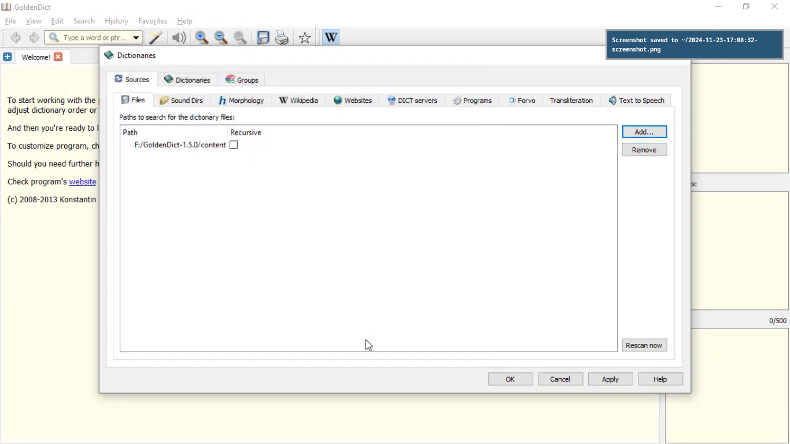
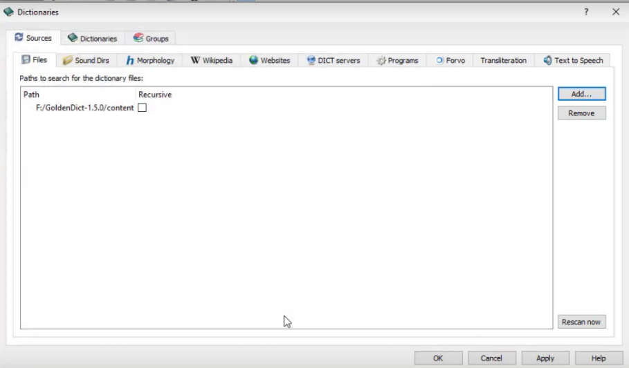

# Một hướng dẫn cài đặt Goldendict khá đơn giản

### Tại sao lại lựa chọn Goldendict?
Mình thường hay gợi ý Yomitan vì có thể tra từ trực tiếp trên trình duyệt và có thể tự chia động từ, nhưng có một số vấn đề:

- Yomitan hỗ trợ Tiếng Nhật là chủ yếu: Hay nói đúng hơn là khối lượng từ điển trên Yomitan chủ yếu là Tiếng Nhật và có không quá nhiều từ điển Tiếng Anh.
- Số lượng từ điển Tiếng Anh rất hạn chế, phần lớn là từ điển Anh - Anh (Để làm được một từ điển Anh - Việt cho Yomitan mà có thể tự động chia động từ thì cần người biết lập trình và khả năng xử lý dữ liệu từ điển).

!!! info "Goldendict hay Goldendict-ng"
    Về cơ bản thì Goldendict-ng là bản cải tiến của Goldendict và có hỗ trợ tạo thẻ Anki. Bạn có thể đọc thêm [Anki Integration](https://xiaoyifang.github.io/goldendict-ng/topic_anki/) từ chính phần Documentation của ứng dụng để tham khảo cách cài đặt

### Hướng dẫn cài đặt cơ bản
Một phần trong mục này mình lấy từ [Hướng dẫn Goldendict của AnkiVN cũ](https://ankivn.blogspot.com/2020/09/goldendict.html) và hiệu đính lại.

Có thể gọi GoldenDict là dạng Data Viewer - bản thân Goldendict là ứng dụng đọc data từ điển - cho nên mình có thể dùng data của nhiều loại từ điển khác nhau. Đây là điểm mạnh nhất của Goldendict vì có thể dùng data của các từ điển nổi tiếng như MDict, Lingvo, Babylon...

Goldendict là dạng _click and see dictionary_, tức là mình bôi đen hoặc click vào word là nó sẽ hiện pop-up. Có hỗ trợ pronunciation đầy đủ

Để cài đặt, bạn hãy di chuyển đến [trang tải xuống của Goldendict](http://www.goldendict.org/download.php) và chọn tệp tải xuống tùy vào hệ điều hành mà máy tính của bạn đang sử dụng (Windows/MacOS/Linux).

Nếu bạn là người sử dụng Linux, thì trong khá nhiều Distro (Bản phân phối Linux) đã có sẵn Goldendict và bạn chỉ cần gõ lệnh cài đặt tệp. Ví dụ trên Debian/Ubuntu thì ta chỉ cần gõ:

```bash
sudo apt install goldendict
```    

Nếu bạn muốn sử dụng Goldendict-ng thì hãy di chuyển đến trang [**Download and Install**](https://xiaoyifang.github.io/goldendict-ng/install/) trong Documentation của ứng dụng.

### Lựa chọn và thêm từ điển
Chính vì Goldendict chỉ là một ứng dụng để xem và hỗ trợ rất nhiều loại từ điển nên nguồn tài nguyên từ điển cho Goldendict là vô cùng nhiều. Bạn có thể tải thông qua các đường dẫn được cung cấp bên dưới đây:

- [SHAREDICTS](https://onedrive.live.com/?authkey=%21AIWJ6XswS%5F1l348&id=C198D829F58B89BB%21550320&cid=C198D829F58B89BB) - Bao gồm OXFORD ADVANCED LEARNER
và LẠC VIỆT
- [GuruDiciStardict dictionaries shared by "dangquybk"](https://www.mediafire.com/?wkai7p5hs9e2m=) - Dữ liệu được tổng hợp bởi **dangquybk** và bao gồm rất nhiều từ điển cho các ngôn ngữ. Bạn có thể đọc thêm bài [GuruDic + dữ liệu stardict phong phú](https://tinhte.vn/thread/gurudic-du-lieu-stardict-phong-phu-tu-dien-da-ngon-ngu-tot-nhat-tren-ios.338525/) trên **Tinh tế** để tải cả dữ liệu từ điển và âm thanh nha.
- [Goldendict và các bộ Đại từ điển Eng-Eng full audio, picture](https://voz.vn/t/reup-goldendict-va-cac-bo-%C4%90ai-tu-%C4%91ien-eng-eng-full-audio-picture.710141/) - Một kho tổng hợp rất nhiều từ điển Tiếng Anh trên Voz Forum.


### Cách thêm từ điển vào trong Goldendict

1. Di chuyển đến thanh công cụ và chọn Edit > Dictionaries. Sau đó cửa sổ Dictionaries sẽ hiện lên




2. Bấm vào nút "Add...".



3. Lựa chọn thư mục mà bạn đã lưu các từ điển bạn đã tải xuống rồi bấm "Select Folder".


4. Ở trong cột Path sẽ có danh sách các thư mục đã được thêm vào Goldendict thành công. Bạn có thể nhấp tick vào "Recursive" để ứng dụng sẽ quét tất cả các thư mục con trong thư mục bạn đã chọn ở bước 3.




5. Bấm vào "Rescan now" rồi bấm "OK" để đóng cửa sổ.
 


### Tích hợp Goldendict với Anki
Cá nhân mình vẫn chưa bao giờ thử nên sẽ viết về phần này sau.

### Danh sách các từ điển gợi ý
Bạn có thể chọn bất cứ các từ điển nào bạn muốn và cá nhân mình gợi ý nên có ít nhất một từ điển cho mỗi phần sau:

- Từ vựng
- Phrasal Verbs
- Synonyms, Thesaurus
- Idioms
- Ngữ pháp

(Mình sẽ bổ sung các lựa chọn gợi ý sau)