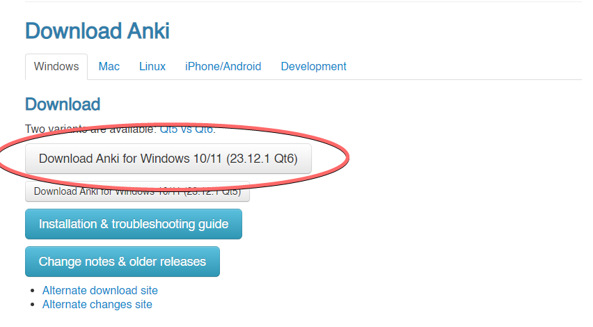
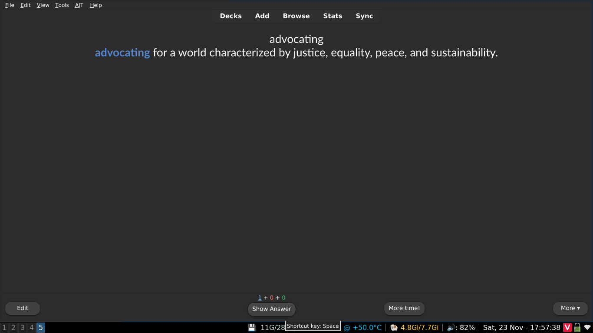
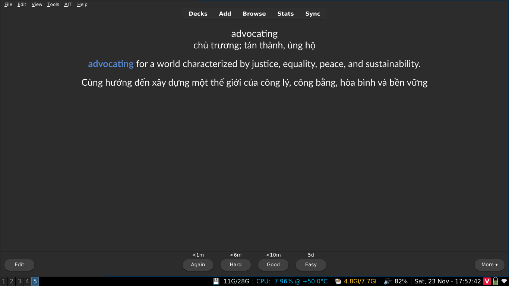

# Một hướng dẫn học Tiếng Anh

## 1.1 Nhiều người học Tiếng Anh "thất bại" là do đâu? 
Bạn hãy đọc bài [Trước khi bắt đầu học](https://daihocmo.github.io/ngoai-ngu/truoc-khi-bat-dau/) từ trang [Tự luyện ngoại ngữ](https://daihocmo.github.io/ngoai-ngu). Bạn hoàn toàn có thể bỏ qua và đọc luôn từ mục 2.1 ngay dưới đây.

## 2.1 Cách học Tiếng Anh

### Quá trình học tập ban đầu

Quá trình học tập mở đầu bao gồm bao gồm:

-   Làm quen với Tiếng Anh.
-   Học từ vựng cơ bản sử dụng *Anki*.
-   Học ngữ pháp.
-   Bắt đầu Immersion với những nội dung đơn giản và lặp đi lặp lại. **Đây là nhiệm vụ cần phần lớn thời gian học của mình**.

### Bảng chữ cái

Bảng chữ cái tiếng Anh (tiếng Anh: English alphabet) hiện đại là một bảng chữ cái Latinh gồm 26 chữ cái. 

Và bảng chữ cái bao gồm phiên âm:

Bốn chữ cái khác mà có trong bảng chữ cái Tiếng Anh nhưng không có trong bảng chữ cái Tiếng Việt là: f, j, w, z.

- [Xem video về phát âm của từng chữ](https://www.youtube.com/watch?v=um3YrKRfsr0)
- [Nghe bài hát bảng chữ cái](https://www.youtube.com/watch?v=ChqnN3cKzXQ)

Sau đó thử nghe [một chút Tiếng Anh](https://www.youtube.com/watch?v=9_RxaeN0FGw)

## 2.2 Học từ vựng

Bạn nên học bộ thẻ từ vựng Anki dành cho người mới bắt đầu. Đây là một bộ thẻ bao gồm khoảng *1700* từ, giúp bạn học những từ Tiếng Anh thông dụng nhất để khởi đầu quá trình học Tiếng Anh của mình.

### Cài đặt Anki nhanh

Anki là một phần mềm flashcard được thiết kế để giúp bạn ghi nhớ lượng lớn thông tin, chẳng hạn như từ vựng.

Truy cập vào [Trang tải xuống của Anki](https://apps.ankiweb.net/), và tải phiên bản Anki cho hệ thống của bạn (Windows, MacOS, Linux) và chạy tệp cài đặt.

Khi mở Anki lần đầu tiên bạn sẽ được yêu cầu cài đặt ngôn ngữ hiển thị, hãy đặt theo mặc định (English). 

Bộ thẻ dành cho người mới bắt đầu mà mình gợi ý là [1700 từ vựng cơ bản](https://drive.proton.me/urls/YMRA0WG5G4#OwdCA78y6sTr) có thể tải xuống thông qua [đường dẫn này](https://drive.proton.me/urls/YMRA0WG5G4#OwdCA78y6sTr) (là tệp có đuôi `.apkg`)

Sau khi quá trình tải xuống hoàn tất, hãy thêm bộ thẻ vào Anki bằng cách chọn "Import file" và điều hướng đến chỗ mà bạn đã tải tệp xuống (.apkg) rồi chọn "Import" ở trên cùng bên phải.

### Hướng dẫn sử dụng Anki nhanh

Trước khi bắt đầu học, bạn nên thay đổi một số cài đặt. Nhấp vào biểu tượng răng cưa bên cạnh bộ thẻ và tiếp tục *Options*.

Thay đổi *Maximum reviews/day* từ `200` ĐẾN `9999`. Đừng lo lắng về con số này, số lượng Reviews (Thẻ bạn cần ôn tập trong Anki) của bạn có thể sẽ không bao giờ đạt đến mức cao như vậy, nó chỉ giúp bạn vượt qua giới hạn đánh giá hàng ngày để có trải nghiệm tối ưu.

Đối với *New cards/day*, `20` có thể hơi quá khó với một số người. Nếu bạn cảm thấy khó khăn khi học 20 từ mới mỗi ngày, hãy thử giảm xuống `10` hoặc thấp hơn.

Anki giúp bạn ghi nhớ mọi thứ bằng cách kiểm tra khả năng nhớ nội dung ở mặt sau thẻ của bạn. Kiểm tra xem liệu bạn có biết nghĩa và cách đọc từ đó hay không. Mọi thứ khác trên thẻ chỉ để hỗ trợ bạn trong quá trình học.

Hãy nhớ là dù *1700 Từ vựng cơ bản* có các câu ví dụ, nó chỉ được thiết kế để dạy những từ đơn lẻ.

Khi thấy một thẻ Anki bạn chưa học (thẻ mới), nên chọn *Show Answer* để có thể thấy những gì ở mặt sau của thẻ.

Khi đã xem xong nội dung thẻ rồi, hãy nhấn *Again* (Bằng với việc "Ôn lại"). Với những thẻ tiếp theo, hãy làm tương tự vì đây cũng là thẻ mà bạn thấy lần đầu.

Lần tiếp theo bạn nhìn thấy thẻ đó là khi kiểm tra lại nội dung mặt sau của thẻ. Hãy cố gắng hết sức để nhớ lại nghĩa và cách đọc ở mặt sau thẻ và tự chấm điểm.

Về cơ bản, đây là cách chúng ta học từ vựng ở giai đoạn mới bắt đầu.

Khi bạn đã hoàn thành các thẻ mới trong ngày, hãy nhớ quay lại vào ngày hôm sau để xử lý các Reviews.

## 2.3 Ngữ pháp

Học ngữ pháp vừa đơn giản lại vừa phức tạp. Ban đầu sẽ khá khó học nhưng quá trình học tập sẽ trở nên dễ dàng hơn khi càng học tiếp. Có rất nhiều tài liệu ngữ pháp, tốt cũng có mà không tốt cũng có. Việc chỉ có một nguồn học ngữ pháp là không đủ cho tất cả mọi người.

Dưới đây là một số hướng dẫn được xếp hạng dựa trên mức độ gợi ý cho tất cả những người mới bắt đầu. Không cần phải học từng hướng dẫn một, chỉ cần chọn một hướng dẫn phù hợp với bạn là được:
 
- [**Study English Grammar - Văn Phạm**](https://www.youtube.com/playlist?list=PLLx8_1BoESGF1wy1P8vhAjw6gdupa2TyE) - Giải thích ngữ pháp rõ ràng, không quá khó hiểu và tập trung vào ngữ pháp Tiếng Anh thay vì cấu trúc ôn thi. Nếu bạn không thích đọc thì có thể xem danh sách bài giảng này.
- [**Hướng dẫn tự học ngữ pháp Tiếng Anh**](https://thu-tram.github.io/toi-hoc-ngu-phap-tieng-anh/) - Hướng dẫn do mình tổng hợp và viết lại.

Đây là thời điểm tốt nhất để bắt đầu Immersion khi bạn đã học được một số cấu trúc ngữ pháp mới. Xem cách áp dụng ngữ pháp đã học vào thực tế sẽ giúp hiểu rõ hơn về chúng.

## 2.6 Immersion cho beginner

Comprehensible Input là Input mà bạn có thể hiểu được, cứ mỗi vài câu lại có một số mảnh ghép bị thiếu. 

Với kiểu Immersion này, trong tiềm thức bạn sẽ tự điền thêm vào những phần bạn thấy chưa hiểu bằng cách đoán ý dựa trên ngữ cảnh, đó là điều giúp cho Input trở nên hữu ích cho việc học ngôn ngữ.

Bây giờ bạn có thể đã nhận thấy một vấn đề ở đây. Bạn sẽ làm gì nếu không có nguồn Comprehensible Input? Là người mới bắt đầu hoàn toàn, không có nội dung nào là dễ dàng. Trên thực tế, đây là lý do tại sao mọi người thường lạc lối và bắt đầu đọc từ tài liệu này sang tài liệu khác. Mặc dù Incomprehensible Input cũng có những tác dụng nhất định và hỗ trợ cho việc học, nhưng sẽ rất khó để có thể vượt qua rào cản ban đầu ấy.

Việc không hiểu được nội dung mình muốn xem/đọc khá khó chịu, trừ khi bạn có một hướng tư duy cụ thể về nó - cảm thấy vui khi biết rằng mình đang tiến bộ dần dần kể cả khi khó có thể thấy một cách rõ rệt. 

Để duy trì tư duy này mọi lúc không hề dễ dàng, không nên dựa vào nó để làm động lực thúc đẩy cho sự kiên trì trong học tập - chìa khóa số một để thành thạo bất kỳ kỹ năng nào.

Vậy làm cách nào để không phải cảm thấy áp lực khi phải tiêu thụ các nội dung khó hiểu?

Chọn những gì bạn thích. Media thực sự khá giải trí vì nhiều lý do khác nhau khác ngoài việc học ngôn ngữ. Bằng cách chọn Media có tính giải trí, thư giãn và có giá trị cao bất kể Level ngôn ngữ nào, chúng ta có thể duy trì liên kết của bản thân với ngôn ngữ và có động lực để tiếp tục thực hiện Immersion. Và dần dần, khi trải nghiệm ngôn ngữ của bạn phát triển, chúng ta sẽ thấy mình hiểu nhiều hơn và mục tiêu từng tưởng chừng như không thể đó là tìm Comprehensible Input giờ đây đã trở thành một điều hiển nhiên, với mục tiêu mới là tiếp tục tìm những nội dung khó hơn để thúc đẩy bản thân tiếp tục học. 

## 2.7 Cách Immersion

### Đọc & Từ điển

Để giúp cho việc đọc Tiếng Anh trở lên dễ dàng hơn thì có thể Yomitan trên trình duyệt. Đọc hướng dẫn tải xuống thông qua [đường dẫn này](setup.md) 

### Lựa chọn nội dung Immersion

Chọn bất cứ nội dung gì bạn muốn. Nó có thể là phim, drama, tiểu thuyết, game hoặc YouTube.

Nếu bạn không nghĩ được gì để xem thì bạn có thể xem [English Media Recommendation](https://daihocmo.github.io/awesome-ngon-ngu/media-recs/tieng-anh/). Chỉ cần bạn thích bất cứ thứ gì bạn chọn để Immersion.

### Cách để thực hiện Listening Immersion 

Chúng ta không muốn suy nghĩ quá nhiều về mọi thứ khi đang nghe. Thả mình theo dòng chảy (flow) cho đến khi bạn nghe thấy thứ mà bạn muốn tra.

Có một số cấp độ nhất định khi nghe. Cấp độ một sẽ là nghe free-flow, nghe theo flow mà không tra từ. Cấp độ hai sẽ là tra những phần bạn muốn tra nhưng vẫn để bài listening chạy. Cấp độ ba sẽ dừng ở mỗi từ chưa biết và tra.

Ở giai đoạn sơ cấp đến trung cấp, kỹ năng nghe hoàn toàn nằm ở cấp độ một và cấp độ hai. Đừng suy nghĩ quá nhiều về điều đó và hãy để ý tất cả những cơ hội nhỏ mà bạn bắt được trong khi nghe.

#### Nghe chủ động và thụ động

Nghe chủ động là khi bạn tập trung hoàn toàn vào việc nghe của mình. Bạn đang thực hiện Immersion tất cả các khía cạnh của nó như là nhìn vào màn hình và xem phim. Đây là kiểu nghe có lợi nhất.

Nghe thụ động là khi bạn làm việc khác và nghe ở chế độ nền. Điều này giúp ích khi bạn thỉnh thoảng nghe phần nghe của mình trong những khoảnh khắc ngắn ngủi, nó có thể mang lại lợi ích to lớn cho bạn nếu bạn có lối sống bận rộn. mình thực sự khuyên bạn nên thực hành thực hiện Immersion thụ động để lấp đầy những khoảng trống mà bạn thường không học Tiếng Anh trong lúc đó.

### Làm thế nào để thực hành Immersion với việc đọc

Ngược lại với việc nghe, đọc là một cách tiếp cận đòi hỏi phân tích và cần nhiều thời gian. Bạn có thể dành bao nhiêu thời gian tùy thích để đọc câu và tra cứu từ. Vòng lặp quy trình về cơ bản là **đọc → tra từ → phản ứng (reaction) → đọc thêm → tra từ → (lặp lại)**. Lúc đầu, điều này có vẻ giống như việc bạn tự đập đầu mình vào tường, nhưng đây thực sự chỉ là cách mà bạn xây dựng khả năng đọc.

### Tỷ lệ lý tưởng giữa nghe và đọc

Ở giai đoạn đầu, bạn nên theo tỷ lệ nghe và đọc là 7:3. Do nghe là hình thức tự nhiên nhất của ngôn ngữ, vì vậy mình tin rằng việc ưu tiên nó là điều cần thiết để khiến bộ não của bạn xử lý Tiếng Anh một cách tự nhiên hơn.

Bạn có thể bắt đầu giảm thời lượng nghe xuống theo tỷ lệ đều 5:5 khi Tiếng Anh của bạn đã tốt hơn.

## 2.8 Vòng lặp học tập của người mới bắt đầu

### Cách làm sai
> Học bảng chữ cái, sau đó học TẤT CẢ 1700 từ trong bộ thẻ cơ bản, sau đó học TẤT CẢ ngữ pháp trước khi bạn thử Immersion lần đầu tiên..
 
Đây là một cách học tệ. **Cần thực hiện mỗi thứ một chút mỗi ngày**.

### Cách làm đúng 

Khi bạn mới bắt đầu học, bạn nên thử bằng xem thứ gì đó bằng Tiếng Anh mà không có phụ đề để xây dựng tinh thần Immersion. Nó có thể là bất cứ điều gì bạn thích và bạn không cần phải hiểu bất cứ điều gì.

Sau đó bạn nên học từ vựng và ngữ pháp cùng một lúc. Bạn nghĩ thế nào về việc học 10 từ mới và học 2 cấu trúc ngữ pháp mỗi ngày? Và trong cùng ngày đó, hãy thực hiện Immersion nhiều hơn.

### "Mình nên thực hành Immersion bao lâu mỗi ngày?"

Mình khuyên bạn nên dành khoảng 1 giờ đến 2 giờ khi bạn mới bắt đầu thực hành Immersion. Bạn hoàn toàn có thể dành nhiều thời gian hơn thế và bạn sẽ tiến bộ nhanh hơn khi thực hiện Immersion nhiều hơn mỗi ngày.

## 3.1 Về nói và viết (Output)

Mọi người thường có quan niệm sai lầm rằng việc tập nói nhiều là cách cải thiện khả năng ngôn ngữ, nhưng thực tế không phải vậy, vì "Input" mà chúng ta có được từ việc nghe và thấy người bản ngữ sử dụng ngôn ngữ mới thực sự hữu ích. 

Mặc dù Output không trực tiếp cải thiện trình độ ngôn ngữ của bạn, nhưng việc luyện tập Output vẫn khá quan trọng, cho dù đó là bằng cách nhắn tin hay tập nói, bởi vì Input và Output luôn song hành với nhau. 

Việc thực hiện Output một cách hiệu quả buộc bộ não của bạn phải đảm bảo rằng nó hiểu chính xác những từ bạn đang nghe và trong tiềm thức, bạn có thể bắt đầu tìm kiếm cơ hội để có thể sử dụng những gì bạn nghe được trong khối lượng Input đó.

Nạp Input thường xuyên song song với việc output thường xuyên.

Trái lại với những gì mà nhiều phương pháp học tập dựa trên Immersion nói, mình không tin rằng việc không thực hiện output của bạn cho đến khi bạn "thực sự giỏi" là một điều tốt vì những lý do như "nói sai sẽ hủy hoại Tiếng Anh của mình". Điều này khiến bạn bỏ lỡ rất nhiều cơ hội để tiếp thu những thứ sẽ sử dụng trong việc output của mình sớm hơn và khiến bạn mang trong mình chủ nghĩa hoàn hảo "độc hại", trở nên quá bảo vệ Tiếng Anh của mình.

## 3.2 Phát âm

Nghe nhiều hơn để có một phát âm tự nhiên và giống người nói Tiếng Anh bản ngữ nhất.

Những người học muốn tiến xa hơn có thể thử học IPA, lý tưởng nhất là càng sớm càng tốt.

## 3.3 Các cột mốc trong quá trình học.

Mình đang nghĩ đến việc viết phần cột mốc để giúp bạn theo dỗi được quá trình học của mình.

## 3.4 Kết thúc hướng dẫn: giai đoạn sau và hơn thế nữa

Thực sự không có gì khác trong quá trình học tập ngoài việc thực hiện Immersion thật nhiều và học từ và ngữ pháp. Bạn thực sự có thể thông thạo Tiếng Anh bằng phương pháp này. Nhưng có một điều sẽ thay đổi khi bạn không còn ở giai đoạn mới bắt đầu.

Việc học từ vựng với Anki sẽ trở nên cá nhân hóa hơn nhiều vì bạn sẽ tự làm những thẻ của mình từ những từ mình tìm được trong quá trình học, được gọi là *mining*. Bạn có thể đọc [Hướng dẫn mining](https://donkuri.github.io/learn-japanese/mining/). Mining về cơ bản sẽ trở thành phần cốt lõi của *việc học* Tiếng Anh.

Cảm ơn bạn rất nhiều vì đã dành thời gian đọc hướng dẫn này. Chúc bạn may mắn trên hành trình học Tiếng Anh của mình!

Nếu bạn có bất kỳ câu hỏi nào, bạn có thể hỏi trên kênh Discord của chúng mình.

[Tham gia cộng đồng học trên Discord](join.md) 

Bạn có thể đọc thêm về 4 kĩ năng ngoại ngữ trong trang [Tự luyện ngoại ngữ](https://daihocmo.github.io/ngoai-ngu/nghe/)

### Nguồn bài viết

Bài viết này được dịch từ bài [Japanese Guide](https://learnjapanese.moe/guide/) và đã hiệu đính lại để phù hợp với những người học Tiếng Anh
