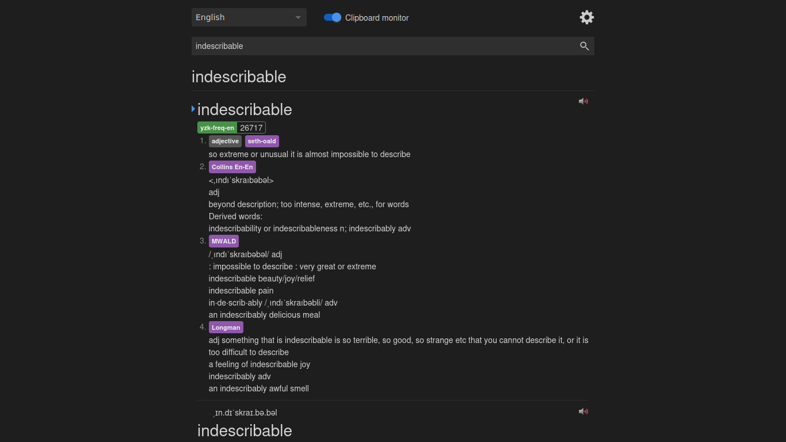
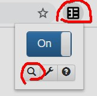

# Hướng dẫn học đơn ngữ

**"Nhắc nhỏ"**: Đây là hướng dẫn dành cho người học trung cấp.

Hướng dẫn này sẽ giải thích quá trình đơn ngữ hóa và tại sao bạn nên làm vậy, các cách khác nhau để truy cập và làm quen với việc sử dụng từ điển đơn ngữ. 

### Quá trình đơn ngữ hóa là gì

"Quá trình đơn ngữ hóa" là khi bạn chuyển sang làm quen với từ điển đơn ngữ, thường với trợ giúp từ điển song ngữ. Từ điển đơn ngữ là từ điển định nghĩa các từ của ngôn ngữ được định nghĩa ở chính ngôn ngữ ấy. Ví dụ: Từ điển Oxford là từ điển tiếng Anh đơn ngữ.

### Tại sao bạn nên sử dụng từ điển đơn ngữ
Từ điển đơn ngữ giúp tránh gây ra những "liên tưởng sai lầm" (false associations) từ Tiếng Việt sang Tiếng Anh. Nếu bạn không sử dụng từ điển đơn ngữ thì dù ngôn ngữ gốc của bạn là gì đi nữa, việc bạn mắc phải những liên tưởng sai lầm là điều khó tránh khỏi. Không có ngôn ngữ nào có thể thể hiện Tiếng Anh tốt hơn Tiếng Anh.

### “Những liên tưởng sai lầm” nghĩa là gì?

Các định nghĩa trong các từ điển đơn ngữ thường rất mơ hồ và không thể hiện đúng cảm giác về nghĩa thực sự của từ này. Đây là một ví dụ: 

> miserable

Chúng ta hãy thử nhìn vào định nghĩa song ngữ của từ này.

> khổ sở

(Lấy trực tiếp từ Labandict)

Giờ hãy xem định nghĩa đơn ngữ của từ này.

*Lấy từ Oxford Learner's Dictionaries*

> very unhappy or uncomfortable (Cực kì bất hạnh hoặc cảm thấy bực bội/khó chịu)

*Và điều này trở nên kém chính xác hơn khi bạn dịch nó về Tiếng Việt.*

Bạn có hiểu được chính xác định nghĩa của từ đó nếu chỉ thông qua từ "khổ sở" không? Không. Có lẽ là không.

Một lý do khác khiến bạn nên sử dụng các định nghĩa đơn ngữ là vì chúng giúp bạn nghĩ bằng Tiếng Anh. Như đã nói ở phần trước, không có ngôn ngữ nào có thể mô tả Tiếng Anh tốt như chính Tiếng Anh. Định nghĩa từ điển là một cách suy nghĩ về từ. Mình chắc rằng các tác giả của những cuốn từ điển đó đã suy nghĩ kỹ về từng định nghĩa trước khi viết ra nó, vì vậy bằng cách đọc định nghĩa và ghi nhớ nó, bạn sẽ có được cảm giác gì đó *ít nhất gần* giống với những gì người bản xứ khi nghĩ về từ đó. 

Nếu bạn học từ bằng từ điển song ngữ Anh-Việt thì bạn sẽ mang trong mình cách suy nghĩ như Tiếng Việt về mọi thứ, và thậm chí không tới được mức mà người bản xứ có thể nghĩ về từ đó. Điều này sẽ khiến bạn không hiểu được nghĩa thực sự của từ. 

Đừng hiểu sai ý mình, bạn vẫn có thể hiểu thực sự thông qua Immersion, chỉ là nó sẽ mất nhiều thời gian hơn so với việc bạn học những từ đó thông qua chính định nghĩa bằng Tiếng Anh.

Từ điển đơn ngữ thực sự rất tuyệt, và bạn sẽ chỉ nhận ra điều này khi bạn bắt đầu sử dụng chúng như một lẽ đương nhiên.

### Tại sao mọi người cảm thấy khó khăn khi bắt đầu chuyển quan đơn ngữ
-   Chưa biết "đủ nhiều" từ vựng.
-   Chưa quen với Tiếng Anh viết.

## Yomitan - Một cách tốt hơn để chuyển qua đơn ngữ.

**Bạn nên thực hiện chuyển qua đơn ngữ với Yomitan.**

Yomitan là một tiện ích mở rộng trên trình duyệt cho phép bạn tra từ trên trang web bằng cách giữ **Shift** và di chuột vào từ đó. Nó được hỗ trợ bởi mọi trình duyệt thuộc dòng Chrome hoặc Firefox. Bạn có thể đọc [hướng dẫn cài đặt Yomitan](https://daihocmo.github.io/ngoai-ngu/yomitan/)

### Chọn và sử dụng từ điển đơn ngữ

Mình sẽ cài đặt sử dụng Yomitan vì nó là tiện nhất để có thể sử dụng nhiều từ điển cùng một lúc.

Hãy truy cập trang [MarvNC/yomitan-dictionaries](https://github.com/MarvNC/yomitan-dictionaries?tab=readme-ov-file#english-english) để tải từ điển đơn ngữ Tiếng Anh cho Yomitan.

### Từ điển gợi ý

Danh sách được trích dẫn trực tiếp từ Antimoon. Bạn có thể đọc bảng so sánh giữa các từ điển trên Antimoon thông qua bài viết [Comparative review of dictionaries for English learners](https://www.antimoon.com/how/learners-dictionaries-review.htm)

- Cambridge Advanced Learner’s Dictionary
- Collins English Dictionary
- Longman Dictionary of Contemporary English (LDOCE)
- Oxford Advanced Learner’s Dictionary (OALD)

Sau đó bạn hãy tải từ điển về và import bộ từ điển đó vào Yomitan.

### Tại sao cần sử dụng nhiều từ điển?

Bạn cần phải có nhiều từ điển vì sẽ luôn có một số từ có trong một số từ điển này nhưng không có trong các từ điển khác. Chúng ta muốn sử dụng từ điển đơn ngữ nhiều nhất có thể ở đây. 

Một lý do khác là các từ điển khác nhau sẽ mô tả một từ theo một cách khác nhau và trong nhiều trường hợp, bạn có thể không hiểu định nghĩa của một từ điển nhưng lại hiểu ở một từ điển khác.

### “Nhưng bạn sẽ phải cuộn rất nhiều để đọc các định nghĩa tiếp theo?” 
Sử dụng phím tắt **Alt + Mũi tên đi xuống**

## Lựa chọn thay thế

### Từ điển trực tuyến 

Google: Tìm “[từ cần tìm] meaning” e.g. "apocalypse meaning” 

### Các lựa chọn ngoại tuyến thay thế 
Bạn sẽ học Tiếng Anh trong một thời gian dài nên có thể Internet của bạn sẽ mất vào thời điểm bạn đang thực hiện Immersion trong ing-lịch.

### Sử dụng Yomitan ngoại tuyến

Bạn vẫn có thể sử dụng Yomitan ngoại tuyến. Đây là cách thực hiện.

Như thế đấy.

### Định dạng từ điển kỹ thuật số

Bạn cũng có thể sử dụng các định dạng từ điển kĩ thuật số khác. Đọc [hướng dẫn cài đặt Goldendict](https://daihocmo.github.io/ngoai-ngu/goldendict/) để tìm hiểu thêm

### Điện thoại

#### Android
- [English Dictionary - Livio](https://play.google.com/store/apps/details?id=livio.pack.lang.en_US)
- [OALD](https://play.google.com/store/apps/details?id=com.oup.elt.oald9) (Oxford Advanced Learner's Dict)  
- [Merriam Webster](https://play.google.com/store/apps/details?id=com.merriamwebster).
- [Aard2](https://github.com/itkach/aard2-android) - Hỗ trợ import một số các định dạng từ điển như của LDOCE. Cho những người muốn mày mò một chút 

#### iOS
Mình không rõ, bạn có thể tự tìm các ứng dụng như ở mục Android trên App Store xem

## Tiếp cận từ điển đơn ngữ

### Mình nên bắt đầu như thế nào?

Đọc Tiếng Anh nhiều hơn. Càng đọc nhiều mình càng cảm thấy quen với Tiếng Anh viết, khi tra từ thì toàn là đơn ngữ từ đó học được nhiều từ hơn, rồi từ đó khả năng sử dụng từ điển đơn ngữ cũng tốt hơn.

Nó thực sự chỉ đơn giản như vậy. Đọc nhiều hơn = đọc từ điển nhiều hơn vì bạn cần từ điển để đọc Tiếng Anh (Bất cứ thứ gì, tiểu thuyết, sách, báo, blog)

### Bạn đã làm gì khi gặp một từ mà bạn không biết khi đọc định nghĩa?

Mình đã tra từ đó bằng Yomitan. Mình đã đọc định nghĩa đơn ngữ và trong trường hợp có quá nhiều từ mình không biết trong định nghĩa, mình sẽ xem định nghĩa Tiếng Việt (như một giải pháp cuối cùng) và tiếp tục. Bạn chỉ cần tiếp tục thực hiện điều này. LẶP ĐI LẶP LẠI.  

Đọc nhiều sách hơn. Bạn sẽ cảm thấy quen với từ điển đơn ngữ nếu bạn đọc nhiều. Thật. Đọc nhiều hơn. Đọc thật nhiều. Đó là tất cả. Yomitan chỉ làm cho quá trình này trở nên dễ dàng hơn, bạn đỡ tốn công tự tìm kiếm trên mạng hay chỗ nào đấy, thay vào đó công sức của mình sẽ dành cho việc đọc. Đó là lý do tại sao bạn nên sử dụng Yomitan.

### Vậy thì... cách tốt nhất để bắt đầu thực hành đơn ngữ là gì?

Đọc thêm sách/tiểu thuyết với từ điển đơn ngữ. Nếu đọc trên trình duyệt nhớ dùng Yomitan nha.

### Nếu không thích đọc tiểu thuyết thì sao?

Tìm thứ gì đó bạn thích. Quan trọng vẫn là đọc những gì mà bạn muốn đọc. 

#### 10 mẹo và thủ thuật quan trọng

1. Đọc ít nhất 1 cuốn sách/tiểu thuyết trước khi chuyển qua đơn ngữ.
2. Hãy thử xem thứ tự sắp xếp từ điển nào là tốt nhất với bạn.
3. Nếu bạn không tìm thấy được phrasal verb hoặc một số từ không phải ở dạng nguyên thể, hãy thử tự chia từ vựng (Nếu không thì tìm trên mạng) về dạng nguyên thể rồi tra lại trên trang tìm kiếm của Yomitan xem, hoặc tra trên Goldendict.
4. Nếu bạn không hiểu định nghĩa ngay cả khi bạn tra cứu tất cả các từ, hãy sử dụng từ điển song ngữ (giải pháp cuối cùng). Bạn sẽ hiểu rõ hơn khi sử dụng từ điển đơn ngữ nhiều hơn.
5. Bạn có thể xem định nghĩa trong từ điển song ngữ để kiểm tra xem bạn có hiểu đúng nghĩa cơ bản của từ hay không (Sau khi đọc xong định nghĩa đơn ngữ).
6. Đừng quá lo lắng về việc sẽ cần bao nhiêu thời gian để chuyển qua đơn ngữ.
7. Đối với thẻ Anki mà sử dụng định nghĩa đơn ngữ, chỉ cần cố nhớ ý chính của định nghĩa là được.
8. Hãy thử tra những từ bạn đã biết trong từ điển đơn ngữ để làm quen với từ điển đơn ngữ lúc đầu.
9. Bỏ qua việc tra cứu những danh từ cụ thể như động vật trong từ điển đơn ngữ, thay vào đó hãy sử dụng Google Hình ảnh.
10. Đừng cố quá. Nếu thấy định nghĩa đơn ngữ quá khó hiểu, hãy quay lại sử dụng từ điển song ngữ.

Have fun immersing!

### Nguồn
Bài viết là bản dịch và hiệu đính lại từ bài [Monolingual Guide](http://learnjapanese.moe/monolingual/) của TheMoeWay.
