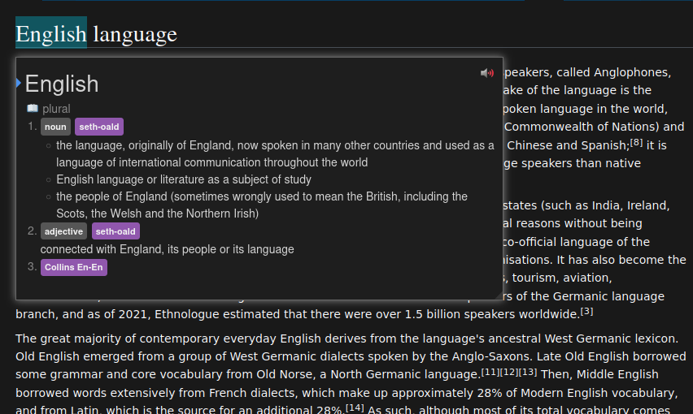

# Hướng dẫn cài đặt Yomitan

## Thông báo

!!! info "Nhắc nhỏ"
	Bài viết là bản dịch và hiệu đính lại từ bài [Yomitan Setup Tutorial](https://learnjapanese.moe/yomichan/) của TheMoeWay.

**Cập nhật chút: Yomitan không còn được hỗ trợ. Yomitan là bản phát triển kế tiếp của Yomitan.**

### Yomitan là gì?
Yomitan là một extension (tiện ích mở rộng) trên trình duyệt (Chrome, Chromium-based hoặc Firefox) cho phép bạn tra cứu các từ Tiếng Anh cả nghĩa lẫn cách đọc trên trang web một cách dễ dàng.

### Bắt đầu
Yomitan có thể tải ở trên cả Chromium và Firefox.

Tải tại đây:

- [Chrome Web Store](https://chromewebstore.google.com/detail/yomitan/likgccmbimhjbgkjambclfkhldnlhbnn) - Cho các trình duyệt như Chrome, Chromium, Brave, Edge hoặc bất kì trình duyệt nào dựa trên nhân Chromium
- [Firefox](https://addons.mozilla.org/en-GB/firefox/addon/yomitan/) - Cho Firefox hay các trình duyệt dựa trên Firefox như Librewolf hoặc Waterfox.

Sau khi cài xong nó sẽ mở một tab mới, bạn đóng trang đó lại và tìm Yomitan trong phần "Tiện ích mở rộng" trong trình duyệt (Hoặc Addons cho Firefox).

### Tải từ điển

Khi bạn mới cài Yomitan lần đầu, bạn sẽ cần cài từ điển để có thể sử dụng nó.

Những tệp này sử dụng phần mở rộng `.zip` (file extension) và **bạn không được giải nén nó ra.**

Bạn có thể di chuyển đến trang [MarvNC/yomitan-dictionaries](https://github.com/MarvNC/yomitan-dictionaries?tab=readme-ov-file#english-english) để cài đặt từ điển cho Yomitan. Bên dưới sẽ có gợi ý từ điển nên dùng và cách cài đặt từ điển vào Yomitan.
 
Các từ điển gợi ý:

- Từ điển Lạc-Việt (Cho những người mới học hoặc những người chưa quen với việc đọc định nghĩa đơn ngữ) (Tìm trong đường dẫn mình để ở trên là có đó)
- Longman Dictionary of Contemporary English (LDOCE) - Về mặt định nghĩa thì Longman có ưu thế hơn so với Oxford. Longman định nghĩa dễ hiểu, ngắn gọn, và nhiều ví dụ. (Gợi ý của bác [Black7](https://voz.vn/u/black7.1242890/))
- Cambridge Advanced Learner’s Dictionary
- Collins COBUILD
- Oxford Advanced Learner’s Dictionary (OALD)

Các tệp từ điển cho Yomitan:

- [Oxford Advanced Learner's Dictionary](https://github.com/MarvNC/yomichan-dictionaries/files/14957647/oald-release-yomitan.zip) - Bạn bấm vào luôn để tải. Bạn cần giải nén tệp .zip ra rồi mới thêm các tệp .zip trong như mục giải nén. Sẽ có 4 tệp `.zip` là: `oald.zip` (Từ điển Oxford chỉ có định nghĩa từ, `oald-extra.zip` (Như trên nhưng bao gồm câu ví dụ) và một từ điển IPA và `yzk-freq-en.zip` (Đo độ phổ biến của từ)). Bạn hãy tự chọn từ điển mà bạn muốn dùng. Đọc thêm bên dưới để biết cách thêm vào Yomitan.
- [apple-en-vi](https://drive.proton.me/urls/XZRWCKDM54#Bnq28tvMixEm) - Với những bạn muốn có từ điển Anh - Việt cho Yomitan, mình chỉ tìm được có bộ này. Bạn bấm vào tên bộ từ điển để di chuyển đến trang tải xuống. Bạn bấm vào thư mục `English`, rồi kéo xuống và tìm `apple-en-vi.zip`.

### Cài đặt từ điển và sử dụng cơ bản
  
1. Bấm vào  icon trên thanh công cụ của trình duyệt.  
2. Bấm vào  icon để mở cài đặt.  
3. Chọn "Dictionaries" ở thanh sidebar bên trái rồi chọn "Configure installed and enabled dictionaries…"  
4. Bấm vào nút "Import" ở bên dưới.  
5. Đây sẽ là lúc mình thêm từ điển, bạn có thể kéo thả hoặc bấm vào ô thêm để lựa chọn từ điển mà bạn muốn thêm.
6. Đợi các từ điển được thêm vào. Sẽ mất một lúc.
7. Sau khi hoàn tất, bạn có thể kiểm tra Yomitan bằng cách giữ phím ++shift++ và di chuột qua văn bản Tiếng Anh. Thử di chuột vào từ này xem: English. Nó sẽ hiện một pop-up box hiển thị các định nghĩa được chia theo từ điển.
 

Bấm ra chỗ khác trên màn hình hoặc phím Esc để ẩn hộp thoại của Yomitan đi

Bạn có thể bấm vào nút  để nghe phát âm từ.

Trên thanh công cụ trình duyệt, nếu bạn chọn biểu tượng Yomitan, sau đó chọn biểu tượng  hoặc dùng tổ hợp phím tắt `Alt+ Insert`, bạn có thể truy cập vào "Yomitan Search" - bạn có thể sử dụng Yomitan như một từ điển Tiếng Anh riêng (Hoàn toàn Offline).
 
Có thể chỉnh kích cỡ Pop-up trong cài đặt và cả giao diện tối nữa.

Nếu bạn thấy phần hướng dẫn khó hiểu thì bạn có thể xem hướng dẫn trên Youtube nha:

<iframe width="560" height="315" src="https://www.youtube.com/embed/MjLw8jZ7aRE?si=KqnQkL6skboYElqq" title="YouTube video player" frameborder="0" allow="accelerometer; autoplay; clipboard-write; encrypted-media; gyroscope; picture-in-picture; web-share" referrerpolicy="strict-origin-when-cross-origin" allowfullscreen></iframe>

### Từ điển đo độ phổ biến của từ 

Yomitan hỗ trợ từ điển tần suất để cho bạn biết độ phổ biến của từ.

Một số các từ điển đo độ phổ biến từ:

(Các tên từ điển dưới đây được mình tổng hợp từ các từ điển đo độ phổ biến mà mình có thể tìm được và cũng không có thông tin là họ dựa vào thang đo gì để đo độ phổ biến. Nhưng mình nghĩ vẫn có thể sử dụng để tham khảo)

- **yzk-freq-en**: Từ điển đo độ phổ biến được làm bởi yzk
- **Frequency-FLT**: Không biết nữa

**Thế nào là từ phổ biến?**  

Rất phổ biến: 1-10,000  
Phổ biến: 10,001-20,000    
Tương đối phổ biến: 20,001-30,000   
Chắc là phổ biến: 30,001-40,000  
Không phổ biến: 40,001-50,000  
Hàng hiếm: 50,001-80,000  
Người-bản-ngữ-chắc-cũng-không-biết: 80,000+  

### Cài đặt với Anki

Bạn hãy đọc bài [Setup](setup.md) để tìm hiểu thêm cách thiết lập Yomitan với Anki để tự động thêm thẻ cho Anki trong lúc tra từ bằng Yomitan trên trình duyệt.